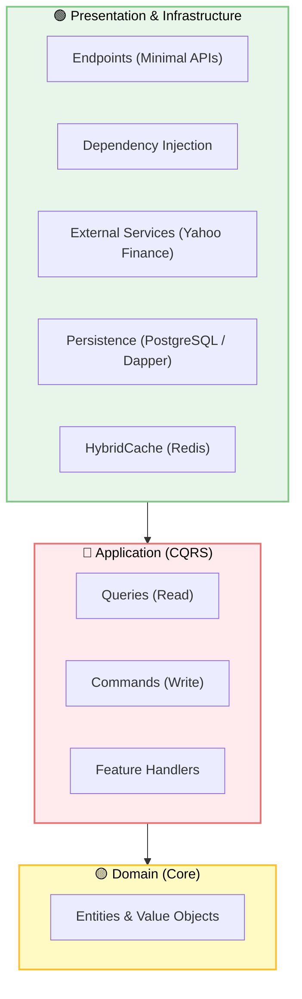

# 📈 Stock Pulse: Professional Real-Time Analytics Dashboard

A simple yet powerful demonstration of **Clean Architecture** and **Real-Time SignalR** integration. Built with **.NET 10** and **Ionic/Angular**, this application serves as a definitive example of how to structure high-performance, decoupled systems for enterprise-grade scalability.

---

## 🏗 Solution Architecture

This project follows a definitive **Onion Architecture** pattern, ensuring that the core business logic remains independent of implementation details like databases or external APIs.



---

## 🛠 Technology Stack

### **Backend (.NET 10 & Aspire)**
- **Clean Architecture Solution Structure**: Decoupled projects by responsibility (**API**, **Application**, **Infrastructure**, **Domain**, **Core**).
- **Cortex.Mediator (CQRS)**: All market logic is handled via discrete, strictly-typed query/handler pairs.
- **SignalR**: Type-safe, real-time WebSocket communication for instantaneous price feeds.
- **Data Persistence**: **PostgreSQL** via Npgsql with optimized indexing for time-series data.
- **High-Performance Caching**: **Redis**-backed **HybridCache** (L1 in-memory / L2 distributed).
- **Aspire Orchestration**: Unified, cloud-native development experience.

### **Frontend (Ionic 8 & Angular 19)**
- **Reactive State Management**: **RxJS**-driven data pipelines for seamless real-time updates.
- **Pulse Design System**: A premium, "Dark Mode" aesthetic using glassmorphism and subtle micro-animations.

---

## 🏗 Architecture & Design Patterns

The application is a showcase for **Definitive Modern Software Engineering**:

- **Strict Layer Separation**: The core business logic depends only on abstractions, while implementation details like **Dapper** and the **Yahoo Finance API** are strictly quarantined in the **Infrastructure** project.
- **Strongly-Typed Hubs**: Uses `IHubContext<Hub<IStocksFeedClientHub>, IStocksFeedClientHub>` to allow the background infrastructure to call typed SignalR methods without referencing the API layer.
- **Self-Healing Data Strategy**: The backend intelligently validates historical data coverage and automatically backfills missing ranges from external providers.

---

## ☁️ .NET Aspire & Service Orchestration

This project serves as a definitive demonstration of **.NET Aspire** for modern, cloud-native development:

- **Unified Service Orchestration**: Automatically manages the lifecycle of **PostgreSQL**, **Redis**, and the **API** project within a single development workflow.
- **Built-in Observability**: Leverages Aspire's integrated **OpenTelemetry** dashboard for real-time tracing, metrics, and health monitoring of all market data pipelines.
- **Seamless Service Discovery**: Simplifies configuration by automatically injecting connection strings and service base URLs, ensuring a "zero-config" development experience.

---

## ⚡ High-Performance Minimal APIs

The **Presentation Layer** demonstrates the power of **.NET Minimal APIs** for building lightweight, scalable microservices:

- **Ultra-Fast Performance**: Bypasses the overhead of traditional MVC controllers, resulting in faster request processing and reduced memory footprint.
- **Code-Based Routing**: Utilizes elegant, fluent endpoint mappings (e.g., `app.MapEndPoints()`) to keep the API surface area clean and maintainable.
- **Integrated OpenAPI**: Automatically generates **Swagger/OpenAPI** documentation directly from the endpoint definitions, ensuring a professional developer experience.

---

## 🧠 CQRS with Cortex.Mediator

This project leverages the **Cortex.Mediator** pattern to implement a strictly decoupled **CQRS (Command Query Responsibility Segregation)** architecture:

- **Thin Presentation Layer**: The API endpoints are purely responsible for receiving HTTP requests and dispatching queries. No market logic is implemented directly in the API project.
- **Strictly-Typed Queries**: Each operation, such as `GetStockPriceQuery` or `SearchStocksQuery`, is a discrete, immutable record defined in the **Application** project.
- **Isolated Feature Handlers**: Logic is encapsulated within specialized `IQueryHandler<TQuery, TResponse>` implementations. This ensures that features are independent, testable, and highly maintainable.
- **Performance Driven**: Cortex.Mediator provides a lightweight, high-performance dispatching engine that aligns perfectly with the sub-millisecond requirements of financial analytics.

---

## 🚀 Key Functionalities

1. **Real-Time Ticker Tracking**: Add your favorite stocks and watch live price movements through established WebSocket connections.
2. **Pulse Insights**: A dedicated history page featuring professional-grade interactive charts.
3. **Flexible Timeframes**: Analyze market trends across **1W, 1M, 3M, 1Y, and 5Y** cycles with a single click.
4. **Infinite Scroll Pagination**: Explore years of detailed price history without UI lag thanks to a robust paginated list implementation.
5. **Global Stock Search**: Instantly discover new assets with an integrated, high-speed search interface.

---

## 📦 How to Run

### **Prerequisites**
- **.NET 10 SDK**
- **Docker** (for PostgreSQL and Redis via Aspire)
- **Node.js** (for Ionic frontend)

### **Backend Setup**
1. Navigate to the `src/BE/API/Stock.RealTime.API` directory.
2. Ensure Docker is running.
3. Run the application via the **Aspire AppHost** or using:
   ```bash
   dotnet run
   ```

### **Frontend Setup**
1. Navigate to `src/FE/ionic/stock_realtime_example`.
2. Install dependencies:
   ```bash
   npm install
   ```
3. Launch the development server:
   ```bash
   ionic serve
   ```

---

## ✍️ Author & Lead

Developed and Architected with passion by:

**Ahmed Samir**  
*Lead Software Developer*  
[Connect on GitHub](https://github.com/ahmedSamir50)

---
*Built for the next generation of financial analysis.*
